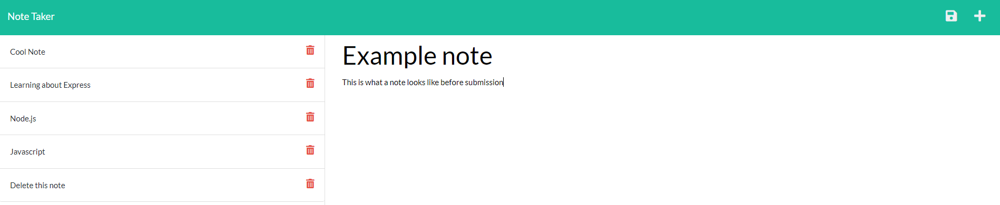

  

  # M11-Note-Taker

  ## Description
  This project is for taking notes, allowing you to create new notes and delete them. During this project I learned to:
  - Use GET routes to navigate to the notes page and navigate to specific notes.
  - Use POST routes to create new notes
  - Use DELETE routes to delete existing notes

  ## Table of Contents
  
  1. [Installation](#installation)
  2. [Usage](#usage)
  3. [License](#license)
  4. [Questions](#questions)
  
  ## Installation
  
  1. This application does not require installation, simply visit https://hidden-gorge-88318.herokuapp.com/ to use it.
  
(<a href="#readme-top">back to top</a>)

  ## Usage
  
  Once you are on the site, simply click the Get Started button to navigate to the notes page.
  The site should look something like this.
  
  
  
  You may now add a note title and text to go with it. Once you are done with the note, click the floppy disk save icon in the top right to save the note
  
  If you wish to delete a note, click on the trash can icon next to the note.
  
  
(<a href="#readme-top">back to top</a>)

  ## License
  Copyright (c) [benjamincottrell](https://github.com/benjamincottrell). All rights reserved. 
  
Licensed under the [MIT license](https://choosealicense.com/licenses/mit/).
  
(<a href="#readme-top">back to top</a>)

  ## Questions
  For any questions feel free to contact me via:
  - GitHub: [benjamincottrell](https://github.com/benjamincottrell)
  - Email: [bencottrell48@yahoo.com](mailto:bencottrell48@yahoo.com)
  
(<a href="#readme-top">back to top</a>)

